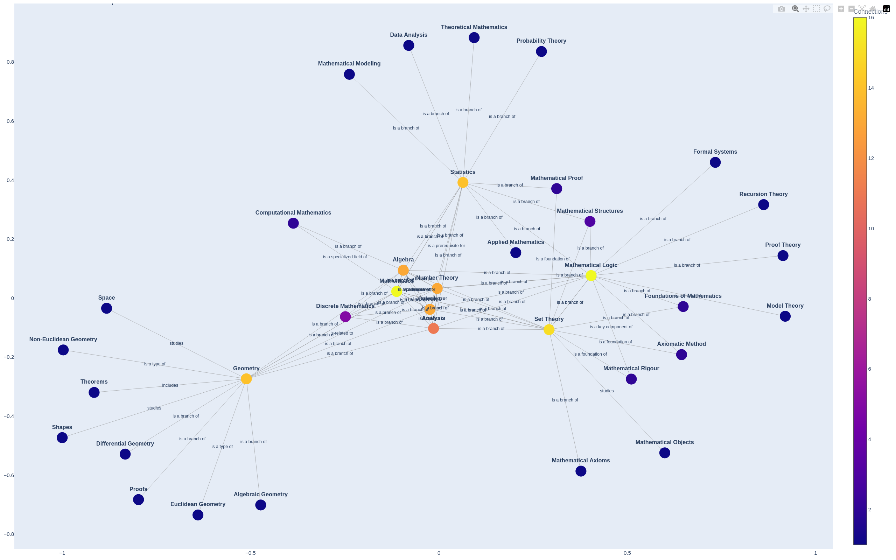

# AGGILE: Automated Graph Generation for Inference and Language Exploration
An instrument for automated graph generation from unstructured data in a controllable and predictable way. Extracts key entities and concepts from the text and generates predicates between them. Based on LLM-prompting.
## Getting Started
You may find walkthrough and sample html-graph in examples folder. Sample json-output is in outputs folder.
Demo is accessible via [link](https://huggingface.co/spaces/missvector/AGGILE).

Import and sample usage of AGGILE:
```python
import sys
sys.path.append('/home/aggile')

from aggile import Aggile, Graph

# Initialize Aggile with your HuggingFace credentials; change the model if needed
aggile = Aggile(model='deepseek-ai/DeepSeek-R1-Distill-Qwen-32B', token='YOUR TOKEN')
# Form triplets from the text
triplets = aggile.form_triples('This is a sample text')
# Visualize graph based on generated triplets
Graph(tripletspip).build_graph() # Saves graph_with_predicates.html
```
If you use bash:
```bash
source .venv/bin/activate
chmod -x example_usage.py
python3 example_usage.py
```
Example of graph:


## Citation
tbd
